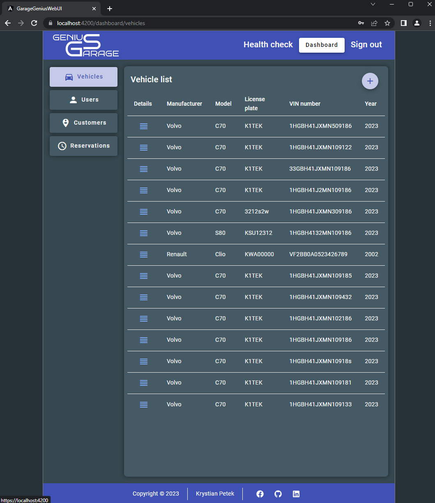
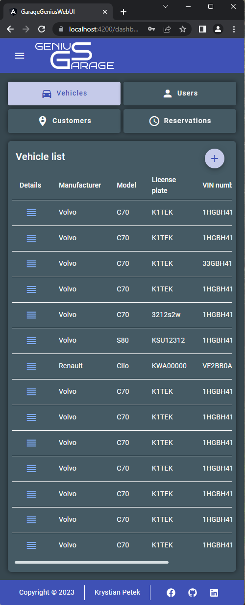

# GarageGenius - an application to improve the management of the service process in a car workshop

The aim of the project is to create a web application for a car garage that will enable easy management of service processes in the company and will allow customers to conveniently and quickly report the need to repair their vehicle, which will improve communication between the garage and the customer.

The application will solve many problems, including:

- It will enable easy and convenient viewing of the vehicle's service history by the customer, which will allow the customer to track repairs and replacements of parts, and thus better understand the technical condition of the vehicle.

- Facilitates the management of vehicle service appointments by allowing customers to submit a repair order online

- It will enable customers to conveniently report the need to repair their vehicle and will allow the customer to post a detailed description of faults.

- It will enable customers to propose repair dates, which will allow for a better adjustment of the service to the customer's needs and to avoid unnecessary delays and difficulties related to the organization of the workshop's work.

- It will allow you to check the repair history of a specific vehicle, thanks to which the workshop will have easier access to information about the service history of a given car and the current status of repairs.

- It will increase customer satisfaction by facilitating the process of reporting service needs, which will affect the perception of the garage as a professional and customer-friendly company.

Implementation of the application - it will be a web application, 1 instance with a database

Technologies used - RestAPI backend in `ASP.NET Core`, `Angular` frontend, `Microsoft SQL Server` database currently in `Docker` containers

### How application actually looks like

WEB

MOBILE
